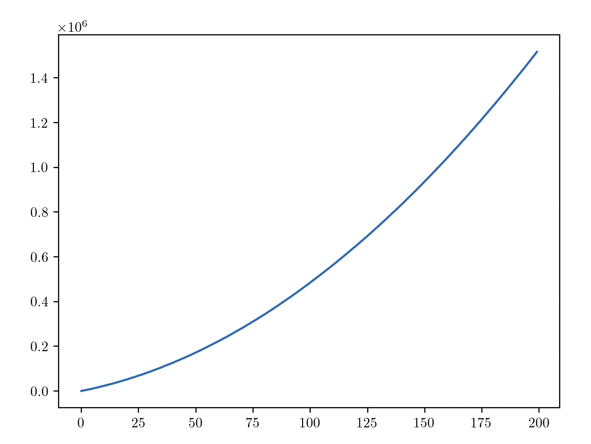

# PROGETTO DI ADVANCED MODELING FOR OPERATION

## Aggiornamenti
* Con l'ultimo commit ho sistemato tutta la conversione in secondi, controllate se per caso mi sono lasciato indietro qualcosa che
può benissimo essere :(.
* Ho fatto il refactoring della funzione read line info e nel file line_info.csv ho aggiunto anche il peso della singola UL
* Ho setuppato il data collector e il batch runner **Occhio che il datacollector funziona solo se c'è uno scheduler che si chiama
scheduler, ieri sera ho smattato**

## To do
* Suddivisione ulteriore in main e classes (ci ho provato ma è un po' compli, forse è meglio se lo facciamo tutti insieme)
* Aggiornamento del modello con logiche fisiche (velocità, potenza ecc...) un pochettino più avanzate

## Tugger train conspumption and speed

* Il consumo viene calcolato secondo lo standard internazionale e viene recepito dai diversi paesi (DIN EN 16796 quello della still che è tedesca, mentre la CAT mantiene l'originale EN16796) quindi anche se dovessimo lasciarlo come consumo medio non penso sarebbe un grosso problema. Ho trovato comunque il testo della BS EN16796 che invece è lo standard internazionale recepite dalla British Standards Online. Visto che gli standard costano tipo 100€ l'uno direi di fare riferimento al BS EN16796 che almeno lo abbiamo incluso con il poli.
* Nel file **ntr30n2ntr50n2 sales brochure spec sheet english final.pdf** e nel file **LTX_20_T04_50_iGo_EN_TD.pdf** ci sono i grafici della velocità in base ai newton trainati, nel primo un po' più professionali, nel secondo un po' più spannometrici. Non ho trovato dati più attendibili per quelli a guida autonoma ma non penso che possano essere molto diversi.

## Aggiornamento 04/11
* I tempi in secondi sono giusti
* Abbiamo unificato tutte le versioni del codice
* Abbiamo aggiunto il controllo sul peso
* Aggiornato la distanza e la velocità nel modulo utils, al momento la velocità è una costante ma si potrà passare una variabile qualunque (quindi anche renderla dipendente dal peso)
* Abbiamo rimosso momentaneamente il data collector e il batch runner perchè secondo noi era inutile.

## Aggiornamento 05/11
* Fixato la condizione sul peso, ora controlla prima di aggiornare self.weight e se passa la condizione allora lo aggiorna definitivamente. Controllato anche l'inizializzazione di self.weight = 0 quando fa l'unloading.

* Modificato il modo con il quale si calcola il tempo di percorrenza del tugger che deve essere path-dependent. Da notare la distinzione fatta tra zone affollate e non. 
* Velocità costante modificata. Ora dipende linearmente dal carico del tugger. 
* Metodo di computazione dell'energia: Due funzioni sono state create. 1) "compute_energy" va a calcolare l'energia nel movimento, dove la relazione con il peso entra in gioco attraverso la variabile tempo. 2) "compute_energy_loading" invece tiene conto del consumo dovuto allo spostamente del UL (1.2 coefficiente che tiene conto di della conversione energia elettrica - cinetica e attrito relative allo spostamento)

## Aggiornamento 06/11
* Fixato il movimento del tugger tra warehouse e stazione di ricarica. Prima si caricava direttamente alla WH. 
* Fixato il calcolo distanza tra stazione di ricarica e prima linea. Prima saltava di netto la prima linea.  

## Aggiornamento 26/11
* Mancano un po' di aggiornamenti, per il periodo dall'ultimo aggiornamento fino ad ora dovremo guardare i commit
* Aggiunto la funzione per la grid search
* Aggiunto strutture dati per la raccolta dei dati durante gli steps
* Aggiunto possibilità di esportare il dataframe come csv
* Aggiunto i parametri per fare il debug del codice
* Aggiunto le funzioni che hanno fatto Ema, Matte e Edo che però non ho ancora guardato :)

## Aggioranmento 27/11
* Migliorato la barra di progressione durante la simulazione
* Implementato l'algoritmo per determinare il numero ottimo di step ma c'è (potenzialmente) un GROSSO problema: con l'algoritmo che abbiamo fatto in classe, secondo me, non possiamo utilizzare l'idle time. L'idle time, infatti, per come è calcolato tenderà a infinito con l'aumento degli steps perchè maggior tempo del sistema significa maggior tempo di inattività.

Ripensandoci ora noi siamo interessati maggiormente che l'idle time sia in un certo senso "stabile" quindi penso si possa anche evitare di determinare il numero degli steps. Mi spiego meglio, sappiamo che la fabbrica lavora 2 turni da 8 ore al giorno e che in questo periodo ci debbano essere meno di 5 minuti di idle time: il numero degli steps secondo me è già noto.

## Aggiornamento 5/12
5->7%  
10->17%  
15->27%  
30->55%  
45->76%  
1->86%  
1:15->95%  
1:30->98%  
1:38 full charge 
Ho messo la funzione di carica della batteria: duranteil coding abbiamo assunto che il tempo si possa interpolare linearmente tra due percentuali "significative".
Nel report finale metterei che abbiamo fatto questa scelta e la scelta di usare i dati dell'iphone perchè abbiamo sentito un esperto e ci ha detto che potrebbe essere un'ottima approssimazione.
